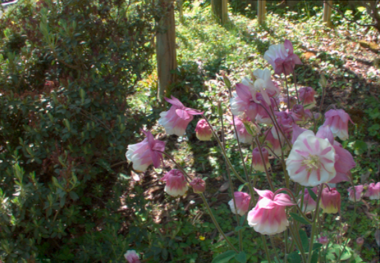
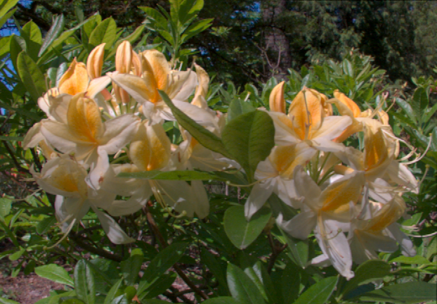
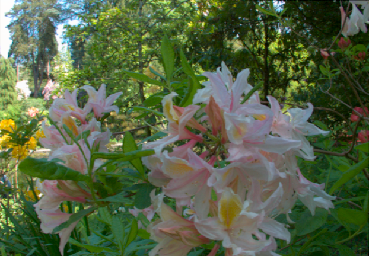
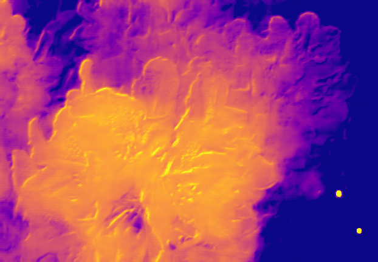
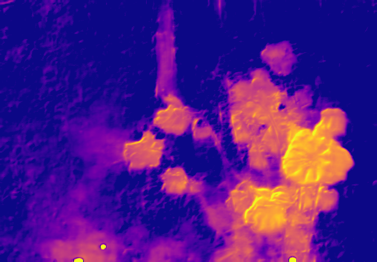
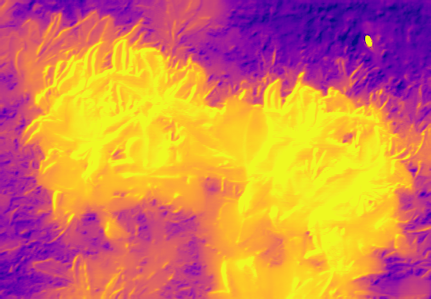
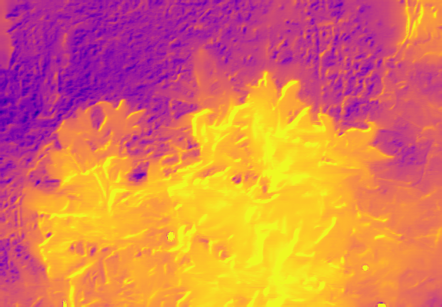
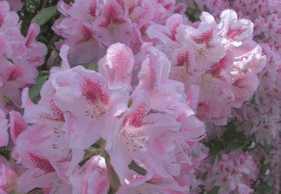
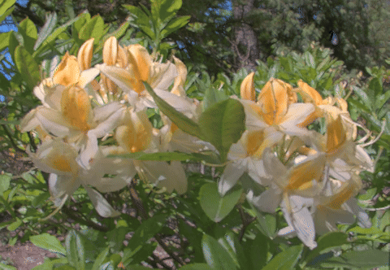
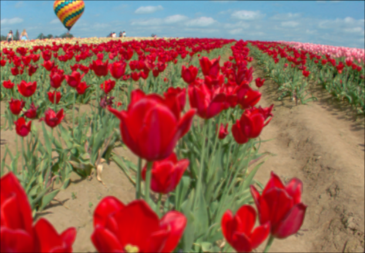

# Learning-to-Synthesize-a-4D-RGBD-Light-Field-from-a-Single-Image
PyTorch Implementation of the paper "Learning to Synthesize a 4D RGBD Light Field from a Single Image"

Paper: https://arxiv.org/abs/1708.03292 

## Dataset
This model was trained on a custom dataset that was captured using the Lytro Illum camera. The captured .LFR images were processed using the plenopticam tool (https://github.com/hahnec/plenopticam) to get the sub-aperture images and the center 9x9 grid of light field data was used.

This model can be used to train the original flower dataset provided my the papers authors here https://cseweb.ucsd.edu/~viscomp/projects/LF/papers/ICCV17/lfsyn/LF_Flowers_Dataset.tar.gz. The model can also be repurposed to use a custom dataset.

## Light Field Synthesis Results
### Input 2D Image
<p align="left">
  
  
  
  
</p>

### Generated Ray Depths
<p align="left">
  
  
  
  
</p>

### Synthesized 4D Light Field
<p align="left">
  
  
  
  
</p>

## Refocus Results
### Image focused on foreground
<p align="left">
  
  
</p>

### Image focused on background
<p align="left">
  
  
</p>

## 🚀 Instructions for Training

- ✅ Setup the Python environment:
  ```bash
  pip install -r requirements.txt
  ```

- 📦 Prepare the dataset for training. Follow the file structure below (shown for a 2-image dataset with a 13×13 grid of sub-aperture views):

<pre>
📁 Light Field Dataset Root Directory
├── 📁 image_1
│   ├── 📄 view_0_0.png
│   ├── 📄 view_0_1.png
│   ├── ...
│   └── 📄 view_12_12.png
├── 📁 image_2
│   ├── 📄 view_0_0.png
│   ├── 📄 view_0_1.png
│   ├── ...
│   └── 📄 view_12_12.png
</pre>

- ▶️ Run training:
  ```bash
  python train.py --training_data_path <path_to_lightfield_data> --weights_save_path <path_to_save_weights>
  ```

- ℹ️ For help with arguments:
  ```bash
  python train.py -h
  ```

---

## 🧪 Instructions for Inference

- ✅ Setup the Python environment:
  ```bash
  pip install -r requirements.txt
  ```

- ▶️ Run inference:
  ```bash
  python test.py ----pretrained_weights <path_to_pretrained_weights> ----input_image <path_to_input_image> --output_path <output_directory>
  ```

- ℹ️ For help with arguments:
  ```bash
  python test.py -h
  ```
